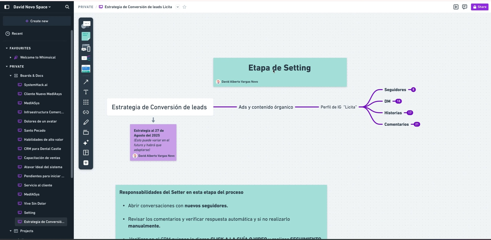
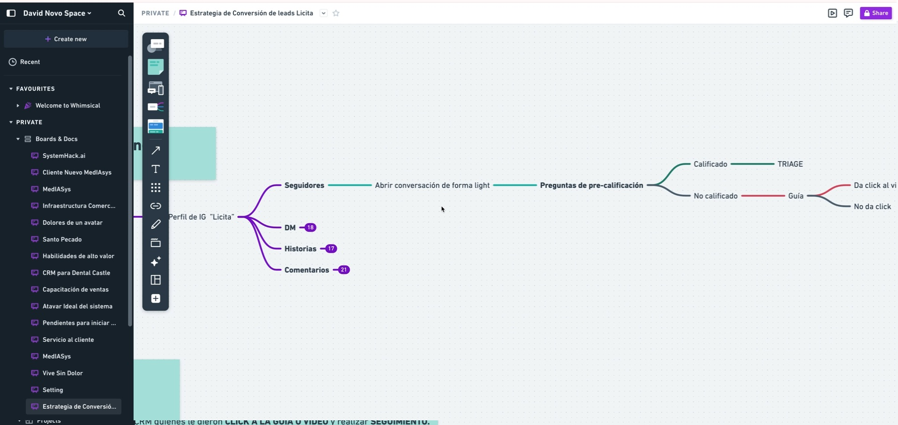

# Procedimiento Operativo Estándar para la Conversión de Leads

## Objective
Este SOP detalla los pasos necesarios para convertir leads en clientes en la primera etapa del embudo de ventas, conocida como la etapa de setting.

<iframe src="https://www.loom.com/embed/d27786327d82497b863c89e8eae8c9e1?sid=6b488a2d-023f-4649-b192-5a094290ab5e" frameborder="0" webkitallowfullscreen mozallowfullscreen allowfullscreen style="position: absolute; top: 0; left: 0; width: 100%; height: 100%;"></iframe>

## Key Steps
 
### Estrategia de Conversión de Leads 0:02

- Iniciar con la estrategia de conversión de leads.  
- Utilizar contenido pagado y orgánico en redes sociales, especialmente en Instagram.
 
### Interacción Inicial con Nuevos Seguidores 3:08

- Abrir conversación de forma ligera con nuevos seguidores.  
- Utilizar un mensaje predefinido para iniciar la conversación.
 
### Precalificación de Leads 3:34

- Hacer preguntas para precalificar al lead.  
- Determinar si el lead está calificado para agendar un triaje o si necesita más información.
 
### Envío de Guía 4:23

- Si el lead no está calificado, enviar una guía a través de un link de video en YouTube.  
- Monitorear si el lead hace clic en el video.
 
### Seguimiento de Leads 8:56

- Realizar seguimiento a los leads que no han hecho clic en el video.  
- Preguntar sobre su interés y si necesitan más información.
 
### Control en el CRM 12:12

- Llevar un registro ordenado en el CRM sobre el estado de cada lead.  
- Actualizar el estado según la interacción y precalificación.
 
### Agendamiento de Triaje 13:26

- Coordinar el agendamiento del triaje con la disponibilidad del equipo.  
- Crear notas con el contexto del lead para facilitar el proceso.
 
### Reporte Diario 13:56

- Al final del día, pasar un reporte sobre el trabajo realizado.  
- Incluir métricas sobre la cantidad de leads y agendamientos.

## Cautionary Notes

- Asegúrate de seguir el flujo de trabajo establecido para evitar confusiones.  
- No descuides el seguimiento a los leads que no han interactuado con el contenido enviado.

## Tips for Efficiency
- Utiliza plantillas de mensajes para agilizar la comunicación con los leads.  
- Revisa el CRM regularmente para mantener la información actualizada y organizada.
