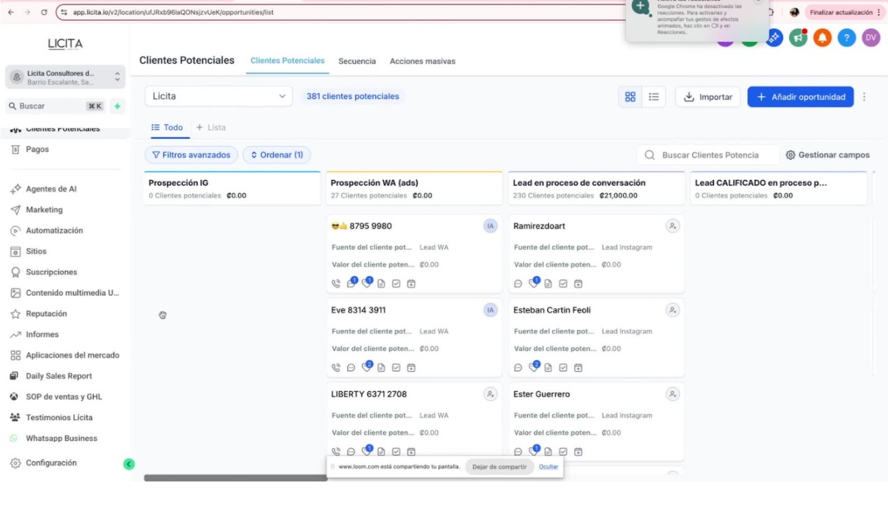
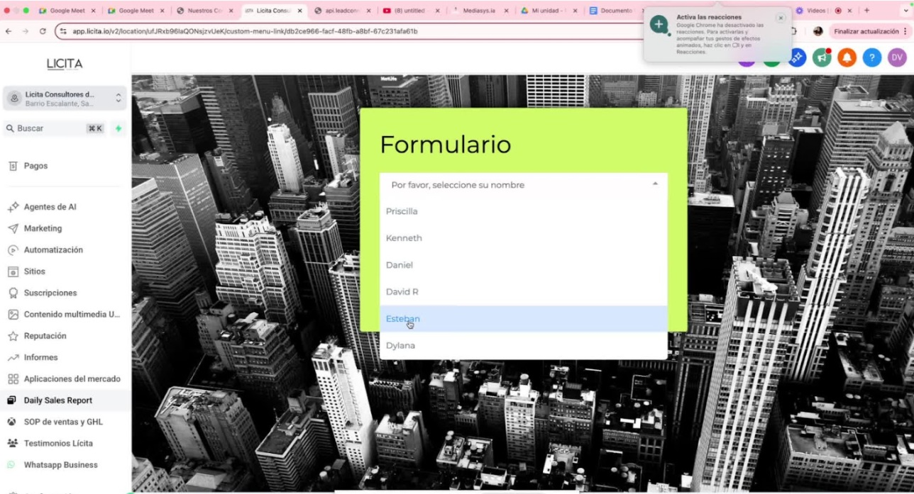
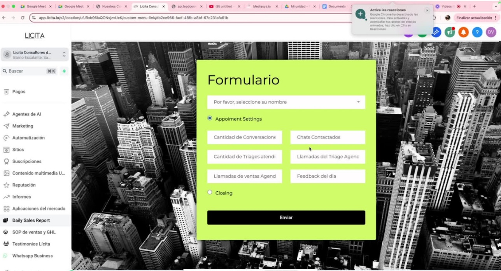

# Procedimiento Operativo Estándar (SOP) para el Reporte Diario de Ventas  

## 🎯 Objetivo  
Este SOP detalla los pasos para completar el **Reporte Diario de Ventas en GoHighLevel (GHL)**, garantizando que el equipo de ventas registre la información de manera clara, completa y consistente.  

<iframe src="https://www.loom.com/embed/46a230cfbdd44d7fac433a77697c935c?sid=9f20a0c9-44ff-4da2-8509-2f11af0e3a98" frameborder="0" allowfullscreen style="width:100%; height:400px;"></iframe>  

---

## 🔑 Pasos Clave  

### 1. Acceso a la Plataforma *(0:02)*  
  
- Inicia sesión en **GoHighLevel**.  
- Desde el menú lateral izquierdo, navega a la sección de formularios.  

---

### 2. Localizar el Reporte Diario *(0:14)*  
  
- Busca la sección **“Daily Sales Report”**.  
- Haz clic en el formulario correspondiente.  

---

### 3. Seleccionar tu Nombre *(0:36)*  
  
- En el formulario, selecciona tu nombre de la lista de miembros del equipo.  

---

### 4. Indicar tu Rol *(0:36)*  
  
- Elige el rol que desempeñaste en el día:  
  - **Appointment Setter**  
  - **Closer**  

---

### 5. Completar los Datos de Ventas *(1:15)*  
  
Registra la información del día según tu rol:  

#### Para Appointment Setters  
- Cantidad de conversaciones iniciadas.  
- Cantidad de chats contactados.  
- Cantidad de triajes atendidos.  
- Llamadas de triaje agendadas.  
- Llamadas de ventas agendadas.  
- Feedback del día (observaciones, aprendizajes, retos).  

#### Para Closers  
- Llamadas de ventas agendadas para el día.  
- Llamadas con **No Show**.  
- Llamadas reagendadas.  
- Seguimientos activos.  
- Ventas realizadas.  
- Feedback del día y objeciones comunes detectadas.  

---

### 6. Revisar y Enviar *(2:04)*  
  
- Verifica que todos los campos estén correctamente completados.  
- Haz clic en **Enviar** para registrar tu reporte.  

---

## ⚠️ Notas Importantes  
- **Obligatorio:** Seleccionar tu **nombre y rol correcto** para evitar confusión en los reportes.  
- **Completitud:** No dejes campos vacíos; todos los datos son necesarios para medir el desempeño.  

---

## 💡 Tips de Eficiencia  
- Completa el reporte **al final de cada jornada** para asegurar datos frescos y precisos.  
- Mantén **notas rápidas** durante el día (ej. en tu CRM, bloc de notas o móvil) para que el llenado del formulario sea más ágil.  
